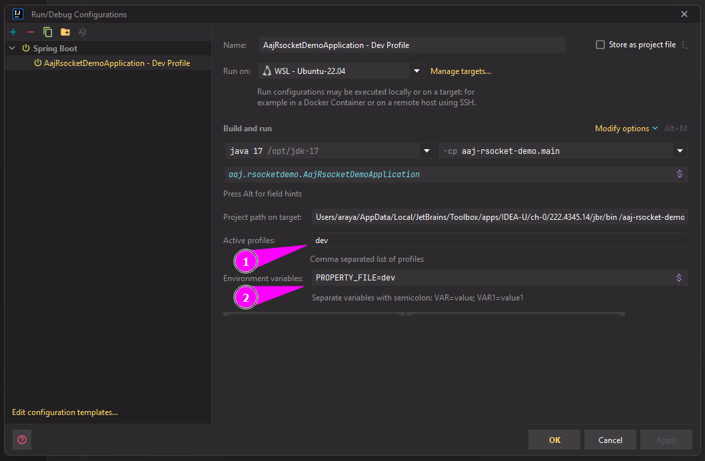

# aaj-rsocket-demo

## How to run:

### From IntelliJ IDEA

Please set the Spring Profile and ENV values as following:



### From JAR execution

First Step: Generate the `.jar`

```bash
 $ gradle bootJar
```

Second Step: Load the `.jar`

```bash
 $ PROPERTY_FILE="dev" java -jar -Dspring.profiles.active="dev" build/libs/aaj-spring-reactive-example-0.0.1-SNAPSHOT.jar
```
